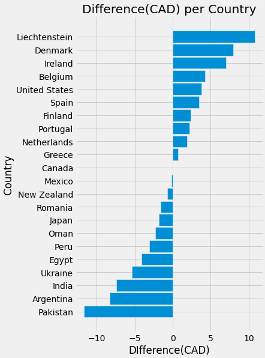
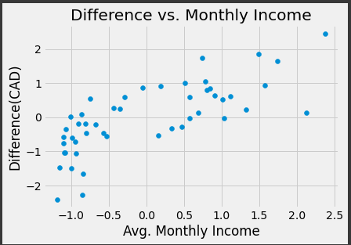

## Netflix
Netflix is the most popular streaming service in the world, having over 222 million subscribers in 190 different countries. This wide-spread popularity is what makes a standard Netflix subscription the perfect product to base a purchasing power parity index on. The differing prices for the same product will allow use to quite accurately guage the true exchange rate between different currencies.

  
  

## How the Index was Created
### 1. Importing Data on Netflix
[comparitech.com](https://www.comparitech.com/blog/vpn-privacy/countries-netflix-cost/) provides a dataset containing the price of Netflix subscriptions for 88 different countries. Accessing the data was as easy as downloading a CSV file and selecting the desired columns.

| Country        | USD Price          |
|:-------------|:------------------|
| Algeria           | 9.99 |
| Bosnia `&` Herzegovina | 9.7  |
| Canada           | 12.1 |

### 2. Cleaning the Data
Luckily, the CSV file was already very clean. There were no missing values, no incorrect data types, nor any formatting issues. However, the dataset uses an ampersand(&) in country names such as 'Bosnia & Herzegovina'. However, the API's I will be using use the actual word 'and'. This easy change was the only cleaning that needed to be preformed on the data.

| Country        | USD Price          |
|:-------------|:------------------|
| Algeria           | 9.99 |
| Bosnia `and` Herzegovina | 9.7  |
| Canada           | 12.1 |

### 3. Factoring in Local Tax Rates
[worldpopulationreview.com](https://worldpopulationreview.com/country-rankings/highest-taxed-countries) provides a CSV file with the general sales tax(GST) of different countries. This data is less clean than the previous file as they are multiple countries with NaN values for their tax rate. Considering there are only a few of these rows, we can drop them without losing too much information. 

Now with the clean tax rate data, we can join the percentages with the table containing our Netflix pricing data. With some simple array multiplication using the NumPy library, we end up with the price of a Netflix subsciption including tax all in USD.

| Country                | USD Price | GST % | USD(+GST) |
|:-----------------------|:----------|:------|:----------|
| Algeria                | 9.99      |   19  |    11.89  |
| Bosnia and Herzegovina | 9.7       |   17  | 11.35     |
| Canada                 | 12.1      |    5  |  12.7     |

### 4. Converting to Local Currencies
To convert the USD price to the local price, we need to first attain the currency codes associated with each country (ex. Canada/CAD, France/EUR). To do so, we make an API call to [restcountries.com](https://restcountries.com).

Once we have the currency code, we now need to find the conversion rate from USD to the local price. Again, a simple API call to [exchangerate.host](https://exchangerate.host/#/) will give us all the needed information.

Finally, we change the USD price to CAD, and then we have a all the information we need to compare the cost of a Netflix sunbscription.

| Country                | CAD Price(+GST) | Local Price(+GST) |
|:-----------------------|:----------------|:------------------|
| Algeria                | 15.2            |   1650.08 DZD	    | 
| Bosnia and Herzegovina | 14.51           |   19.63 BAM       |
| Canada                 | 16.23           |    16.23 CAD	     |

### 5. Calculating the Differences
Given that we live in Canada, our analysis will be centerted on Canadian data. Therefore, we will subtract the cost of a Canadian Netflix subscription from every country and look at the differences. Although our analysis collected data on 73 different countries, the below graph shows the difference of 20 countries. I ensured that the maximum value and the minimum value were displayed so we can get an idea of the wide difference in range.

### 6. External Factor
To better understand why the cost of netflix varies so widely(around $20 CAD difference between the cheapest and most expensive country), we will look at the average monthly salary in each country. Perhaps countries with less expensive subcriptions have a lower average salary, so people are unable to afford the higher prices of other countries' subscriptions.

This data for average salaries was scraped from [worlddata.info](https://www.worlddata.info/average-income.php). This data was the least clean, as the salaries were strings containing dollar signs($), commas(,), and spaces(). To make the data uasable these all needed to be removed so that the value could be converted into a float. 

| Country        | Average Monthly Salary(USD)      |
|:-------------|:------------------|
| Algeria           | 524 $ |
| Bosnia and Herzegovina | 898 $  |
| Canada           | 4,026 $ |

Unfortunately, the dataset for salaries was not as comprehensive as the previousy gathered data. Therefore, once the two tables were joined only 48 countries had information in both datasets. However, this size is still large enough to make predictions.

When we calculate the correlation coefficent for the data, we get a value of about **0.77**. This suggests that there is a strong postive relation between the two variables.

## Conclusion
Through this exploration, it appears as if the price of Netflix is affected by the average salary of a country. This seems evident as we look at the two extrema of the datasets. Pakistan has the cheapest cost of a Netflix subscription but it also has the lowest monthly income. The same applies to Liechtenstein which has both the most expensive Netflix subscription and the highest monthly salary. Given that the correlation coefficent is rather high, this suggests there exists a strong relation. However, we know that correlation does not imply causation. Perhaps, they may be some third factor in which the both salary and Netflix prices are dependat upon.

