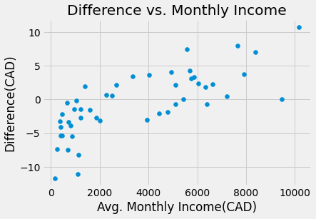

Completed for CMPUT 199 - Introduction to Data Science

## Purchasing Power Parity
Purchasing Power Parity (PPP) is an economic theory explaining why the price of the same product differs across different countries. Through indexes like The Big Mac Index, people compare the prices of a product around the world in order determine the PPP of different currenices.

## Netflix
Netflix is the most popular streaming service in the world, having over 222 million subscribers in 190 different countries. This wide-spread popularity is what makes a standard Netflix subscription the perfect product to base a purchasing power parity index on. Since the prices differ greatly between countries for the exact same product, we are able to determine the true exchange rate for different currencies.

  
  

## How the Index was Created
### 1. Importing Data on Netflix
[comparitech.com](https://www.comparitech.com/blog/vpn-privacy/countries-netflix-cost/) provides a dataset containing the price of Netflix subscriptions for 88 different countries. Accessing the data was as easy as downloading a CSV file and selecting the desired columns.

| Country        | USD Price          |
|:-------------|:------------------|
| Algeria           | 9.99 |
| Bosnia `&` Herzegovina | 9.7  |
| Canada           | 12.1 |

### 2. Cleaning the Data
Luckily, the CSV file was already very clean. There were no missing values, no incorrect data types, nor any formatting issues. However, the dataset uses an ampersand(&) in country names such as 'Bosnia & Herzegovina'. However, the API's and other datasets I will be using use the actual word 'and'. This easy change was the only cleaning that needed to be preformed on the data.

| Country        | USD Price          |
|:-------------|:------------------|
| Algeria           | 9.99 |
| Bosnia `and` Herzegovina | 9.7  |
| Canada           | 12.1 |

### 3. Factoring in Local Tax Rates
[worldpopulationreview.com](https://worldpopulationreview.com/country-rankings/highest-taxed-countries) provides a CSV file with the general sales tax(GST) of different countries. This data is less clean than the previous file as they are multiple countries with NaN values for their tax rate. Considering there are only a few of these rows, we can drop them without losing too much information. 

Now with the clean tax rate data, we can join the percentages with the table containing our Netflix pricing data. With some simple array multiplication using the NumPy library, we end up with the price of a Netflix subsciption including tax all in USD.

| Country                | USD Price | GST % | USD(+GST) |
|:-----------------------|:----------|:------|:----------|
| Algeria                | 9.99      |   19  |    11.89  |
| Bosnia and Herzegovina | 9.7       |   17  | 11.35     |
| Canada                 | 12.1      |    5  |  12.7     |

### 4. Converting to Local Currencies
To convert the USD price to the local price, we need to first attain the currency codes associated with each country (ex. Canada/CAD, France/EUR). To do so, we make an API call to [restcountries.com](https://restcountries.com).

Next, we need to find the conversion rate from USD to the local price. An API call to [exchangerate.host](https://exchangerate.host/#/) will give us a dictionary containing the exchrange from USD to all other currenices. We can use the currency codes we just found as the look-up key in the dictionary to find the value we will multiply the USD price by to get the local price.

Finally, we multiply the entire USD by the Canadian exchange rate to get the price in CAD. Now, we have a all the information we need to compare the cost of a Netflix sunbscription.

| Country                | CAD Price(+GST) | Local Price(+GST) |
|:-----------------------|:----------------|:------------------|
| Algeria                | 15.2            |   1650.08 DZD	    | 
| Bosnia and Herzegovina | 14.51           |   19.63 BAM       |
| Canada                 | 16.23           |    16.23 CAD	     |

### 5. Calculating the Differences
Given that we live in Canada, our analysis will be centerted on Canadian data. Therefore, we will subtract the cost of a Canadian Netflix subscription from every country and look at the differences. Although our analysis collected data on 73 different countries, the below graph shows the difference of 20 countries. I ensured that the maximum value and the minimum value were displayed so we can get an idea of the wide range of prices.

### 6. External Factor
To better understand why the cost of netflix varies so widely(over $20 CAD difference between the cheapest and most expensive country), we will look at the average monthly salary in each country. I hypothesize that countries with lower salaries will have cheaper subscriptions since people do not have as much money to spend on goods and services like Netflix. Likewise, countries with higher salaries will have more money to spend so their subscription will be more expensive.

The data for average salaries was scraped from [worlddata.info](https://www.worlddata.info/average-income.php). This data was the least clean, as the salaries were strings containing dollar signs($), commas(,), and spaces(). To remove these impurities, we applied a simple cleaning function that removed all non-numerical characters. From there, we can convert the values to floats and the multiply the entire column by the Canadian exchange rate. This leaves us with clean data in CAD.

| Country        | Average Monthly Salary(USD)      |
|:-------------|:------------------|
| Algeria           | 524 $ |
| Bosnia and Herzegovina | 898 $  |
| Canada           | 4,026 $ |

Unfortunately, the dataset for salaries was not as comprehensive as the previously gathered data. Therefore, once the two tables were joined only 48 countries had information in both datasets. However, this size is still large enough to make predictions.

It is important to take notice of the two extrema of the graph. As mentioned above, Pakistan has the cheaperest subcrition price, but it also has the lowest salary. Similiarly, Liechtenstein is the country with the most expensive Netflix cost but it has the highest monthly salary. By looking at the graph, it appears as if there is a linear correlation. However, graphs can be decieving. When we calculate the correlation coefficient, we get an r-value **0.77**. This confirms our hypothesis and proves that there is a correlation between the two variables.

## Conclusion
As mentioned above, Pakistan has the cheapest Netflix subscription and Lichtenstein has the most expensive. Given that the r-value was 0.77, this suggests there is a strong correlation between the cost of Netflix and the average monthly salary of a country. Therefore, it appears that the external factor makes an impact, however we must be careful to not conflate correlation with causation.

No interesting information was found as the data displays exactly what you would expect. The price of Netflix in developed nations is higher, while the price is cheaper in developing countries.

So, in conclusion, if you are someone who pays for Netflix, it may be in your best interest to use a VPN and change your location to Pakistan. However, there's an even better option that we have yet to discuss. Really, you should stop wasting your money on subscription services altogether and just pirate everything.

